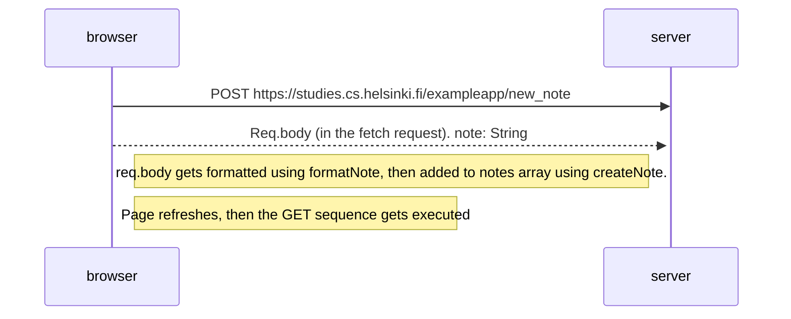

```mermaid
sequenceDiagram
    participant browser
    participant server

    browser->>server: POST https://studies.cs.helsinki.fi/exampleapp/new_note
    activate server
    browser-->>server: Req.body (in the fetch request). note: String
    activate server

    Note right of browser: req.body gets formatted using formatNote, then added to notes array using createNote.

    Note right of browser: Page refreshes, then the GET sequence gets executed
```
